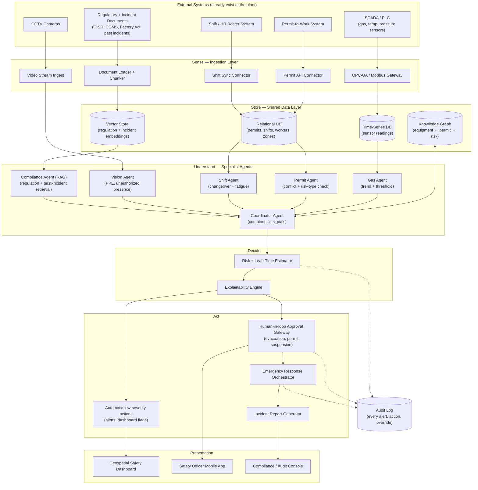
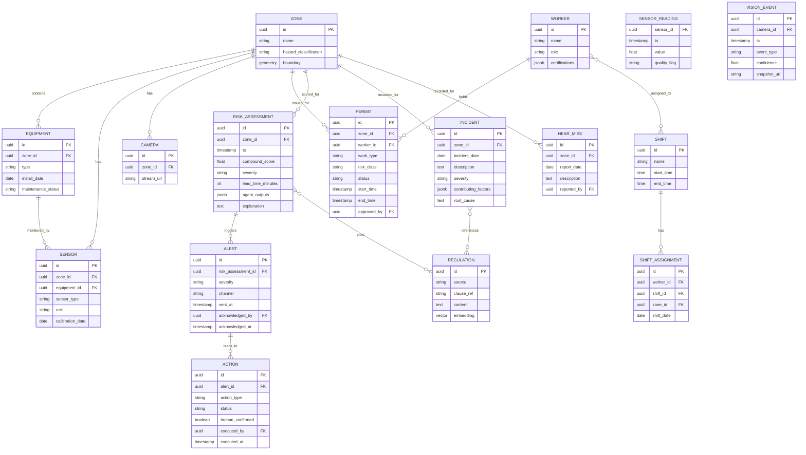

# Industrial Safety Intelligence — Real-System Design (Draft v1)

This is a draft for discussion, not a final spec. Sections marked **[OPEN QUESTION]** are
places where I made a default choice but it's genuinely your call — flag anything you want
changed and we iterate here before any code gets written.

**Decided:** Database topology and knowledge-graph timing are locked in (see §2) — one Postgres
instance with extensions, foreign keys instead of a dedicated graph database for the pilot.

---

## 1. Architecture Diagram

Five layers, matching the mental model from before: **Sense → Store → Understand → Decide → Act**,
plus a Presentation layer on top and two things that cut across everything (Audit Log, Auth).



**Key design decisions baked into this diagram:**
- Each agent reads only the data it's expert in; the **Coordinator** is the only thing that sees everything and reasons across signals — this is what makes it a real multi-agent system instead of one scoring function.
- **Human-in-loop Gateway** sits between "we're confident this is dangerous" and any irreversible action (evacuation, permit suspension). **Decided:** reuse the same four severity buckets already in the risk engine (`normal` / `warning` / `critical` / `extreme`) as the cutoff, rather than inventing a separate scale:
  - `normal` / `warning` → fully automatic — dashboard update, log entry, notify the zone supervisor. Low-cost, reversible, no approval needed.
  - `critical` → automatic *notification* (siren, push to the safety officer's phone) fires immediately, but any action that changes physical state — suspending a permit, isolating equipment — needs one human click to confirm.
  - `extreme` → same human-confirm rule for evacuation-class actions, but the system pre-stages everything (drafts the evacuation announcement, identifies who to notify, freezes sensor data) so confirming is one click instead of manual coordination under pressure.
  - Per-hazard-type overrides (e.g. confined-space entry warranting auto-suspend at `critical` instead of `extreme`) are a simple lookup table keyed by hazard type — not hardcoded into the agents.
- Vision Agent and Compliance Agent both need their own data prep pipeline (video ingest, document chunking) before they can do anything — these are the two most expensive pieces to build for real, so they're natural candidates for a later rollout phase, not day one.

---

## 2. Database Schema

Three storage engines, because these entities genuinely don't fit one shape well:

| Store | Tech (suggested) | Holds |
|---|---|---|
| Relational (Postgres) | source of truth for structured entities | zones, equipment, sensors, workers, shifts, permits, alerts, incidents, actions |
| Time-series (Postgres + TimescaleDB extension, or InfluxDB) | high-frequency sensor readings | raw and rolled-up sensor values |
| Vector store (pgvector inside the same Postgres, or a dedicated vector DB) | regulation clauses + incident text embeddings | for the Compliance/RAG agent |

**Decided:** one Postgres instance with the TimescaleDB and pgvector extensions — not three separate
systems. Reasoning: one database is simpler to run, back up, and secure than three, and a single-plant
pilot's data volume doesn't come close to needing dedicated infrastructure per store. Revisit and split
out a store only if a specific one becomes a real bottleneck (e.g. sensor-ingest volume outgrows what
Timescale-on-Postgres can handle at the plant's actual sampling rate).

### Entity-relationship diagram



**Notes on choices:**
- `RISK_ASSESSMENT.agent_outputs` is a JSON blob holding each specialist agent's raw score + reasoning — this is what makes `explanation` auditable later ("why did the system say critical" → you can always point at exactly which agent(s) drove it).
- `ACTION.human_confirmed` is a boolean specifically so you can prove, per incident, whether a human clicked "go" or the system acted alone — this matters both for trust and for any regulatory/liability review after a real incident.
- **Decided:** equipment↔permit↔risk relationships (the "knowledge graph" piece) start as plain foreign keys in this same relational schema, not a dedicated graph database (e.g. Neo4j). Reasoning: at pilot scale (one plant, a few hundred equipment/permit rows) these are ordinary SQL joins — a graph database earns its keep only once queries turn genuinely multi-hop across many plants ("has this equipment type + work type combination ever preceded an incident anywhere in the company"). Revisit once that need actually shows up.

---

## 3. Making it pluggable for any plant

**Decided:** this is a single-tenant app — one install per plant, not a multi-tenant platform serving
many plants from one deployment. That rules out a `PLANT` table and any `plant_id` scoping: plant
identity (name, location) is deployment-time config (an env var or a small settings file read once at
startup), not a database concept. `ZONE` no longer carries a `plant_id` — it's implicitly "this
installation's plant." That's one less table and one less join everywhere else in the schema.

"Pluggable for any plant" now means something narrower and simpler: **the same codebase deploys
cleanly to a new plant by changing configuration, not by changing code** — not "one running system
serves many plants at once." The rule: separate what's identical across every install from what's
different at this one, and make the second group pure **configuration** — rows in the database or a
config file — never code. Standing up a new plant's install should look like "fill out a form
describing this plant," not "write new code."

**What's actually different, plant to plant:**
- Layout — different zones, different equipment
- SCADA vendor/protocol — Siemens, Honeywell, Rockwell, plain Modbus, proprietary systems
- Permit-to-work software — every plant runs something different (or still runs paper)
- Sensor thresholds — "50 ppm CO is critical" can differ by gas, by local regulation
- The regulatory rulebook itself — OISD/DGMS/Factory Act is India-specific; a plant elsewhere needs a different set of documents
- Which data sources even exist — not every plant has CCTV or digitized permits

**What never changes (the plumbing already designed in §1–2):** the database schema, the Coordinator's
reasoning logic, the risk/lead-time/explainability engine, the dashboard/mobile UI shell.

**The four mechanisms that make the difference pluggable:**

1. **Connector adapters** — one common interface ("give me current readings for zone X"), a different
   adapter per SCADA vendor/protocol behind it. A new plant with a different SCADA system needs one new
   adapter written against the interface, nothing else in the system changes.
2. **Everything plant-specific lives in the database, not in code** — zones, equipment, and sensor/hazard
   thresholds live as rows, all hanging off `zone_id` (no `plant_id` needed, per the decision above).
   Standing up a new install means inserting configuration rows and setting a handful of env vars, not
   touching application code.
3. **Regulation packs** — the Compliance Agent's document corpus becomes a swappable "pack" chosen at
   deploy time (e.g. an India pack: OISD + DGMS + Factory Act; a different country gets a different pack),
   instead of being baked into the agent's prompt or logic.
4. **Agents are optional per install, via a registry** — each specialist agent declares what data it
   needs; a plant with no CCTV simply has `vision_agent: disabled` in its config, and the Coordinator
   combines whichever agents are actually active rather than assuming all five always report in.

If a future version ever needs to serve several plants from one shared deployment (e.g. a head office
dashboard rolling up multiple sites), that's a different, additive problem — reintroducing a `PLANT`
table and `plant_id` scoping then, rather than carrying that complexity now for a single-tenant app that
doesn't need it.

### 3.1 What "installing to a new plant" actually looks like

One file, filled in by whoever's setting up that plant's install (safety team + IT, not a developer),
plus a handful of secrets that never go in the file itself:

```yaml
# plant.config.yaml — filled in once per installation, not touched again day-to-day

plant:
  name: "Rourkela Steel Works"
  location: "Odisha, India"
  timezone: "Asia/Kolkata"

regulation_pack: "india-oisd-dgms-factoryact-v1"

shifts:
  pattern:
    - { name: Morning,   start: "06:00", end: "14:00" }
    - { name: Afternoon, start: "14:00", end: "22:00" }
    - { name: Night,     start: "22:00", end: "06:00" }
  changeover_window_minutes: 15
  fatigue_after_hours: 6

zones:
  - id: battery_3
    name: "Coke Oven Battery 3"
    hazard_classification: high
    boundary: [[120, 40], [320, 40], [320, 160], [120, 160]]   # for the dashboard map
    equipment:
      - { id: coke-oven-1, type: coke_oven, install_date: 2011-03-01 }
    sensors:
      - { id: S-47, type: co_ppm,  unit: ppm, thresholds: { warning: 35, critical: 50, extreme: 75 } }
      - { id: S-48, type: h2s_ppm, unit: ppm, thresholds: { warning: 5,  critical: 10, extreme: 20 } }
    cameras:
      - { id: cam-b3-01, stream_url: "rtsp://10.0.4.21/battery3" }

connectors:
  scada:         { adapter: opcua,        endpoint: "opc.tcp://10.0.1.5:4840" }
  permit_system: { adapter: generic_rest, endpoint: "https://ptw.plant.local/api" }
  shift_roster:  { adapter: generic_rest, endpoint: "https://hr.plant.local/api/shifts" }

agents:
  gas_agent: enabled
  permit_agent: enabled
  shift_agent: enabled
  vision_agent: disabled       # this plant has no CCTV integration yet
  compliance_agent: enabled

automation:
  overrides:                   # per-hazard-type exceptions to the default cutoff (§1)
    confined_space_entry:
      human_confirm_from: critical   # stricter than the extreme default
```

Secrets — DB password, SCADA credentials, the LLM API key — live in environment variables or a secrets
manager, never in this file, since the file itself is safe to keep in version control per plant.

**The actual install steps, end to end:**
1. Copy the template above, fill in this plant's zones/equipment/sensors/connectors/agents with its
   safety and IT team — an afternoon of configuration work, not a code change.
2. Set the handful of secrets for this install (DB connection string, SCADA credentials, LLM API key).
3. Run a one-time bootstrap script that reads `plant.config.yaml` and inserts the zone/equipment/sensor/
   camera rows into that install's database.
4. Deploy the same Docker image everywhere — the application code is identical across every plant.

The one caveat: if a new plant's SCADA vendor or permit software has never been seen before, that one
connector adapter still needs to be written once — but that's a one-time cost per **vendor**, not per
**plant**. Every subsequent plant using an already-supported vendor installs with zero new code, just
this file.

---

## Decided

1. ~~Single Postgres (with Timescale + pgvector extensions) vs. three separate specialized databases?~~ → **One Postgres instance with extensions.**
2. ~~Skip dedicated graph DB for the pilot, model relationships as foreign keys instead?~~ → **Yes, foreign keys for now.**
3. ~~Severity cutoff for automatic vs. human-confirmed action?~~ → **Reuse the existing normal/warning/critical/extreme buckets** — automatic through `warning`, human-confirm required from `critical` up, with a per-hazard-type override table. See §1 above.
4. ~~Pilot scope?~~ → **Coke-oven-battery-style zone: gas readings + confined-space permit + shift changeover** — this mirrors the Battery 3 / Vizag scenario already built and demoed, so it reuses a hazard pattern that's already understood instead of picking a new one cold. Start with real gas sensors and the real permit system for just that one zone before expanding to others.

No open questions remain in this draft — flag anything above you want revisited, otherwise this is ready to build from.

---

## TODO: Computer Vision Agent (recommended approach, not yet built)

Everything else in "what you may build" — compound risk, geospatial heatmap, compliance,
incident pattern intelligence, worker location, emergency response — is built and verified.
Computer Vision / CCTV analytics is the one piece still outstanding, and it deserves a scoped
recommendation rather than a half-built implementation, because the obvious version of this
feature (PPE compliance detection — hard hat, vest, gloves) is **not honestly achievable**
without a specialized dataset:

- **What a general-purpose local model (e.g. YOLOv8n, pretrained on COCO) can actually do
  out of the box:** detect that a person is present in a camera frame, with genuine accuracy.
  Nothing PPE-specific — COCO has no "hard hat" or "hi-vis vest" class.
- **What it cannot do without real investment:** classify whether that person is wearing
  correct PPE. That needs a model fine-tuned on an industrial PPE dataset (public ones exist,
  e.g. Roboflow's hard-hat-workers datasets) plus validation against this plant's actual
  camera angles and lighting before anyone should trust it for a compliance decision. Getting
  this wrong in either direction is worse than not having it: false negatives miss real PPE
  violations, false positives train safety officers to ignore the alert.

**Recommended MVP scope, when this gets built:**
1. A `VisionAgent` behind the same agent interface as the others (`agents/vision_agent.py`),
   gated by `agents.vision_agent` in `plant.config.yaml` (already scaffolded, currently `false`).
2. Person-presence detection only, on camera frames from the `cameras` already defined per
   zone in the config schema (`ZoneConfig.cameras` — schema exists, just unused today).
3. The actual safety value without needing PPE classification at all: cross-reference
   *"a person was detected in this zone"* against the same worker-location and permit data
   the rest of the system already has. A person detected in a high-hazard zone with **no**
   matching active permit or badge record is a real, useful compound-risk signal on its own —
   it doesn't need to know what they're wearing to be worth flagging.

**Phase 2, once there's budget/time for it:** swap in (or add alongside) a PPE-specific
classifier — either a fine-tuned local model validated against this plant's own camera
footage, or a cloud vision API with a PPE-detection feature (e.g. AWS Rekognition, Azure
Custom Vision) — the same kind of provider/cost decision made for embeddings, deliberately
deferred rather than picked silently.
